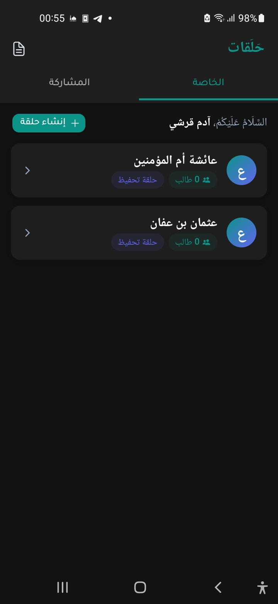
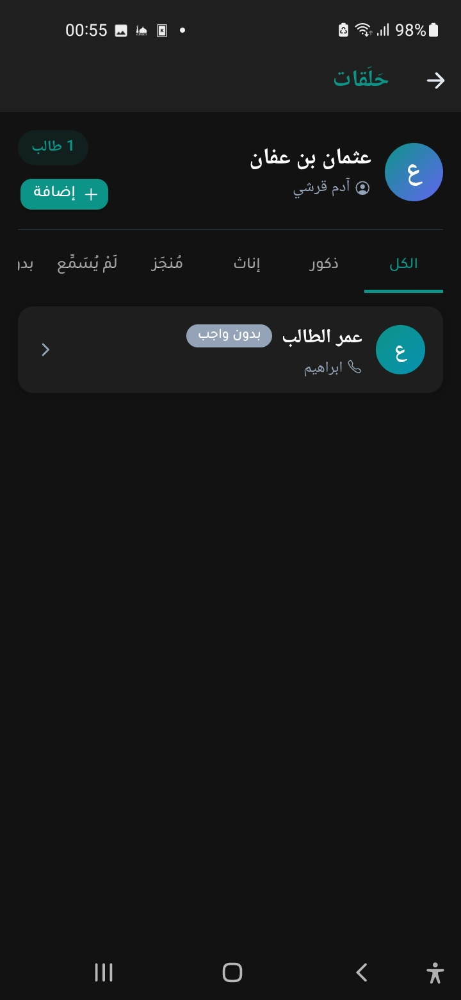
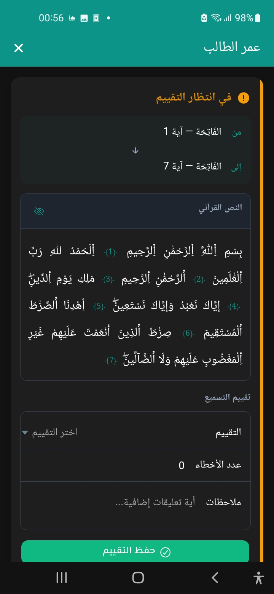
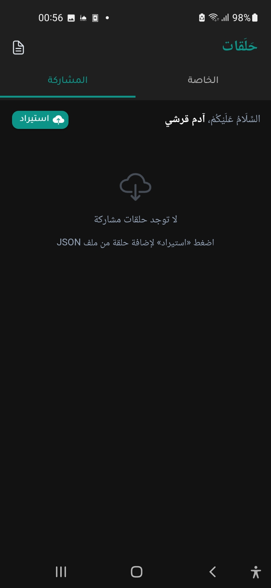

<div dir="rtl">

# حَلَقات 📖

تطبيق متكامل لإدارة حلقات تحفيظ القرآن الكريم، مبني بتقنية **Ionic + Angular + Capacitor** للعمل على أجهزة **Android**.

<p align="center">
  
  
  
  
</p>


---

## ✨ المميزات الرئيسية

### 📋 إدارة الحلقات
- إنشاء حلقات تحفيظ متعددة
- عرض عدد الطلاب لكل حلقة
- حذف الحلقات مع تأكيد للحماية من الحذف العرضي

### 👨‍🎓 إدارة الطلاب
- تسجيل الطلاب بمعلوماتهم الكاملة (الاسم، الجنس، تاريخ الالتحاق، بيانات ولي الأمر)
- متابعة حالة الواجبات اليومية لكل طالب
- عرض ملف كامل لكل طالب مع سجل واجباته

### 📝 تتبع الواجبات والتسميع
- تسجيل الواجبات بتحديد السورة والآية (بداية ونهاية)
- تقييم الأداء بمقياس متدرج: **ممتاز / جيد جداً / جيد / يحتاج مراجعة / غائب**
- إضافة ملاحظات على كل واجب
- تصفح آيات الواجبات بكل سهولة؛ فالتطبيق يحتوي على المصحف الشامل برواية ورش ضمن قاعدة بياناته المدمجة.

### 📊 استخراج التقارير بصيغة Excel
- تقرير لطالب منفرد يشمل كامل سجل أداءه
- تقرير شامل لجميع طلاب الحلقة
- تقرير موحّد يضم عدة حلقات دفعةً واحدة
- يدعم المشاركة الفورية عبر تطبيقات الهاتف

### 🔗 مشاركة واستيراد الحلقات
- تصدير بيانات الحلقة كملف JSON
- استيراد حلقات من أجهزة أخرى
- الحلقات المستوردة تُعرض في تبويب **"المشاركة"** بصيغة للقراءة فقط
- يدعم التطبيق الفتح التلقائي لملفات JSON من مدير الملفات أو عبر المشاركة بفضل إعدادات **Intent Filters** في `AndroidManifest.xml` واستخدام مكتبة `@mindlib-capacitor/send-intent`.

### 🗄️ قاعدة البيانات المحلية
- تخزين كامل على الجهاز باستخدام **SQLite** عبر `@capacitor-community/sqlite`
- لا يحتاج اتصالاً بالإنترنت
- معرّفات فريدة (UUID) لضمان سلامة البيانات عند الدمج والمزامنة

---

## 🛠️ التقنيات المستخدمة

| التقنية | الغرض |
|---|---|
| Angular 20 | إطار العمل الأمامي |
| Ionic 8 | مكونات واجهة المستخدم |
| Capacitor 8 | تحويل التطبيق لتطبيق Android أصيل |
| SQLite (`@capacitor-community/sqlite`) | قاعدة البيانات المحلية |
| ExcelJS | توليد تقارير Excel |
| `@capacitor/filesystem` | حفظ الملفات |
| `@capacitor/share` | مشاركة الملفات |
| `@mindlib-capacitor/send-intent` | استقبال الملفات وفتحها (JSON) |
| `date-fns` | تنسيق التواريخ |

---

## 🚀 البدء السريع

### المتطلبات الأساسية
- Node.js 18+
- Java 17+ (لبناء Android)
- Android Studio أو ADB

### تثبيت المشروع

```bash
git clone https://github.com/AdamKourchi/Halaqat.git
cd Halaqat
npm install
```

### تشغيل التطبيق في المتصفح

```bash
npm start
```

### تشغيل التطبيق على Android

```bash
npm run build
npx cap copy android
npx cap open android
```

أو مباشرةً عبر Ionic CLI:

```bash
ionic capacitor run android
```

---

## 🗂️ هيكل المشروع

```
src/
├── app/
│   ├── core/                  # المنطق الجوهري للتطبيق
│   │   ├── models/            # نماذج البيانات (Circle, Student, Homework...)
│   │   ├── repositories/      # طبقة الوصول إلى قاعدة البيانات
│   │   ├── services/          # الخدمات (Excel، JSON)
│   │   ├── database/          # إعداد SQLite والهجرات
│   │   ├── guards/            # حماية المسارات
│   │   └── helpers/           # أدوات مساعدة
│   ├── features/              # صفحات وميزات التطبيق
│   │   ├── home/              # الصفحة الرئيسية (تبديل بين الخاصة والمشاركة)
│   │   ├── my-circles/        # إدارة حلقاتي
│   │   ├── shared-circles/    # الحلقات المستوردة
│   │   ├── circle-details/    # تفاصيل الحلقة وقائمة الطلاب
│   │   ├── student-profile/   # ملف الطالب وواجباته
│   │   └── register/          # شاشة تسجيل المعلم
│   └── shared/                # مكونات مشتركة
└── assets/                    # الموارد الثابتة
```

---

## 📐 نماذج البيانات الأساسية

### الحلقة `Circle`
```typescript
{
  id: string;          // UUID
  teacher_id: string;  // مرجع المعلم
  name: string;        // اسم الحلقة
  type: string;        // 'Beginner' | 'Revision' | 'Adults'
  creation_date: string;
}
```

### المعلم `Teacher `
```typescript
{
  id: string;          // UUID
  name: string;        // اسم المعلم
  contact_info: string;        // معلومات الاتصال
  is_owner: boolean;       
}
```

### الطالب `Student`
```typescript
{
  id: string;
  circle_id: string;
  name: string;
  gender: 'Male' | 'Female';
  enlistment_date: string;
  parent_name?: string;
  parent_contact?: string;
}
```

### الواجب `Homework`
```typescript
{
  id: string;
  student_id: string;
  date_assigned: string;
  start_surah: number;   // رقم السورة
  start_ayah: number;    // رقم الآية
  end_surah: number;
  end_ayah: number;
  grade_mark?: string;   // 'Excellent' | 'Very Good' | 'Good' | 'Needs Work' | 'Absent'
  mistakes_count?: number;
  remark?: string;
}
```

---

## 📤 تصدير البيانات

### تصدير حلقة بصيغة JSON
من داخل تفاصيل الحلقة اضغط على زر المشاركة → سيتم توليد ملف JSON يمكن إرساله عبر أي تطبيق تواصل.

### استيراد حلقة
من الصفحة الرئيسية → تبويب **"المشاركة"** → اضغط على زر الاستيراد واختر ملف JSON.

---

## 📝 ملاحظات التطوير

- تعمل قاعدة البيانات بصورة **محلية بالكامل** على الجهاز دون أي خادم.
- الحلقات المستوردة **للقراءة فقط** تفادياً لتعارض البيانات.
- تصدير Excel يدعم **الكتابة من اليمين إلى اليسار** (RTL) افتراضياً.
- يستخدم التطبيق بيانات القرآن الكريم المُضمَّنة محلياً لعرض أسماء السور.

</div>
